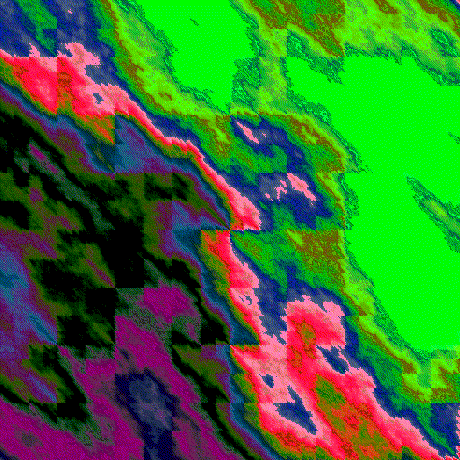
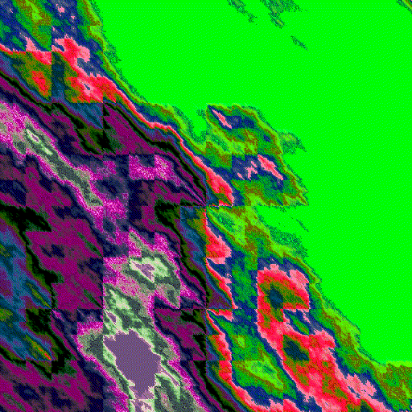

# Plasma Cloud Generator

<div align="center">

*A comprehensive, parallelized plasma cloud generator with support for custom palettes, animations, and various generation modes.*

</div>

## Table of Contents

- [Features](#features)
- [Installation](#installation)
- [Quick Start](#quick-start)
- [Usage Examples](#usage-examples)
- [Generation Modes](#generation-modes)
- [Example Outputs](#example-outputs)
- [Command-Line Options](#command-line-options)
- [Testing](#testing)

## Features

- 🎨 Multiple generation modes (roughness, blur, layered, colormap)
- 🌊 Diamond-square algorithm
- 🎭 Support for custom .map palette files and Matplotlib colormaps
- 🎲 On-demand palette generation
- 🎬 Animated GIF creation
- ⚡ Parallel processing for efficient batch creation
- 📝 Detailed logging and metadata output

## Installation

1. Clone the repository:

```bash
git clone https://github.com/yourusername/plasma-cloud-generator.git
cd plasma-cloud-generator
```

2. Install the required dependencies:

```bash
pip install -r requirements.txt
```

Or install them manually:

```bash
pip install numpy matplotlib pillow
```

## Quick Start

Generate a single plasma image with default settings:

```bash
python PlasmaCloud.py
```

Generate with custom parameters:

```bash
python PlasmaCloud.py --output_dir "MyPlasma" --res "1024x768" --num_images 10 --seed 42
```

## Usage Examples

### Basic Generation

```bash
# Generate 5 images with default settings
python PlasmaCloud.py --num_images 5

# Generate with custom resolution
python PlasmaCloud.py --res "1920x1080" --num_images 3
```

### Palette Management

```bash
# Generate new palettes
python generatepalettes.py

# Or use built-in palette generation
python PlasmaCloud.py --generate_palettes --num_palettes_to_generate 100
```

### Animation Creation

```bash
# Create animated plasma GIFs
python PlasmaCloud.py \
    --output_dir "AnimatedPlasma" \
    --res "512x512" \
    --num_images 5 \
    --animate \
    --frames 30
```

### Batch Processing

```bash
# Generate with multiple roughness values in parallel
python PlasmaCloud.py \
    --mode roughness \
    --roughness_levels 1 2 4 8 16 \
    --num_images 20 \
    --max_workers 4
```

## Generation Modes

### Roughness Mode

Control the texture detail level:

```bash
python PlasmaCloud.py --mode roughness --roughness_levels 1 2 4 8 16
```

### Blur Mode

Apply different blur levels:

```bash
python PlasmaCloud.py --mode blur --blur_levels 0 2 4 6 8
```

### Layered Mode

Create complex textures by layering:

```bash
python PlasmaCloud.py --mode layered --num_images 10
```

### Colormap Mode

Use Matplotlib colormaps:

```bash
python PlasmaCloud.py --mode colormap --num_images 5
```

## Example Outputs

### Roughness Variations

| Roughness = 2 | Roughness = 4 | Roughness = 8 | Roughness = 16 |
|---------------|---------------|---------------|---------------|
|  |  |  |  |

### Blur Variations

| Blur = 0 | Blur = 2 | Blur = 4 | Blur = 6 |
|----------|----------|----------|----------|
|  |  |  |  |

### Random Generation


### Animations

#### Roughness Animation


#### Blur Animation



#### Combined Animation



## Command-Line Options

```
usage: PlasmaCloud.py [-h] [--output_dir OUTPUT_DIR] [--res RES] [--num_images NUM_IMAGES] 
                      [--palette_dir PALETTE_DIR] [--mode {default,roughness,blur,layered,colormap}]
                      [--roughness_levels ROUGHNESS_LEVELS [ROUGHNESS_LEVELS ...]] 
                      [--blur_levels BLUR_LEVELS [BLUR_LEVELS ...]] [--animate] [--frames FRAMES] 
                      [--seed SEED] [--max_workers MAX_WORKERS] [--generate_palettes] 
                      [--num_palettes_to_generate NUM_PALETTES_TO_GENERATE]

Options:
  -h, --help            Show this help message and exit
  --output_dir OUTPUT_DIR
                        Output folder (default: PlasmaCollection)
  --res RES             Resolution as WIDTHxHEIGHT (default: 512x512)
  --num_images NUM_IMAGES
                        Number of base images to generate (default: 5)
  --palette_dir PALETTE_DIR
                        Folder with .map palette files (default: Palettes)
  --mode {default,roughness,blur,layered,colormap}
                        Generation mode (default: default)
  --roughness_levels ROUGHNESS_LEVELS [ROUGHNESS_LEVELS ...]
                        Roughness levels (default: [1, 2, 4, 8, 16])
  --blur_levels BLUR_LEVELS [BLUR_LEVELS ...]
                        Blur levels (default: [0, 2, 4, 6])
  --animate             Generate animated GIFs
  --frames FRAMES       Number of frames for animation (default: 20)
  --seed SEED           Seed for reproducibility
  --max_workers MAX_WORKERS
                        Max parallel processes
  --generate_palettes   If the palette directory is empty, generate a set of random palettes
  --num_palettes_to_generate NUM_PALETTES_TO_GENERATE
                        Number of palettes to generate when --generate_palettes is used (default: 150)
```

## Testing

Run the unit tests to verify the functionality:

```bash
# Run all tests
python test_plasma_generator.py

# Run with verbose output
python test_plasma_generator.py -v

# Run specific test
python -m unittest test_plasma_generator.TestPlasmaGeneratorEnhanced.test_parallel_generation
```
---

<div align="center">

</div>